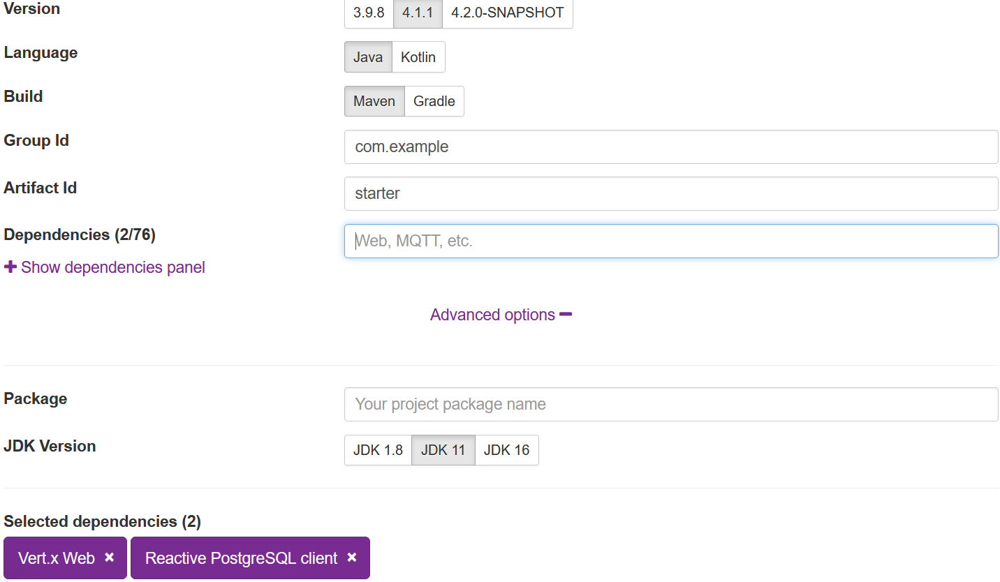

# Building RESTful APIs with Eclipse Vertx

In this post, we will explore how to build a simple RESTful example application with Eclipse Vertx and reactive Postgres Client.

Unlike other frameworks in which *reactive* is an addition to the existing features, Eclipse Vertx is born for *reactive applications*,  read [the official introduction guide](https://vertx.io/introduction-to-vertx-and-reactive/) to get know the reactive support in Vertx .

Similar to the [Spring Boot intializr](https://start.spring.io),  Eclipse Vertx also provides a scaffold tool to generate the project skeleton for you.

Open your browser, navigate to the [Vertx Starter page](https://start.vertx.io/).  In the **Dependencies** field, select *Vertx Web*, *Reactive  PostgreSQL Client*, and optionally expand the **Advance options** and select the *latest Java version*(at the moment it is **25**). 



Leave others options as they are, it will use the default values, then hit  **Generate Project** button to generate the project into an archive for downloading.

Download the project archive, and extract the files into local disc, and import into your IDEs, eg. Intellij IDEA.

Open the *pom.xml*.  As you see, it uses `maven-shade-plugin` to package the built results into a fat jar, and  the *Main-Class* is `io.vertx.launcher.application.VertxApplication` and the *Main-Verticle* entry declares the main verticle to deploy. When running the application via `java -jar target\xxx.jar` , it will use the `VertxApplication` to deploy the declared `MainVerticle`.  A `Verticle` is a Vertx specific deployment unit to group  the resources, such as Network, HTTP, etc.

Let's move to the `MainVerticle` class.

```java
public class MainVerticle extends VerticleBase {
    
}
```

Generally , to code our business logic, you just need to override the `start()` method that returns a `Future<?>`.

In our application, we will start a HTTP Server to serve the HTTP requests.  Replace the content of the `start()` method with the following.

```java
// Create the HTTP server
return vertx.createHttpServer()
    // Handle every request using the router
    .requestHandler(router)
    // Start listening
    .listen(8888)
    // Print the port
    .onSuccess(server -> {
        System.out.println("HTTP server started on port " + server.actualPort());
    })
    .onFailure(event -> {
        System.out.println("Failed to start HTTP server:" + event.getMessage());
    });
```

The request handling work is done by  the above `.requestHandler(Handler<HttpServerRequest>)`. The `Router` is a specific `Handler<HttpServerRequest>`  which simplifies the handling HTTP requests and allows chaining a sequence of handlers.

Add a `routes` method to handle requests  of all routes in a central place, it returns the router.

```java
//create routes
private Router routes(PostsHandler handlers) {

    // Create a Router
    Router router = Router.router(vertx);
    // register BodyHandler globally.
    //router.route().handler(BodyHandler.create());
    router.get("/posts").produces("application/json").handler(handlers::all);
    router.post("/posts").consumes("application/json").handler(BodyHandler.create()).handler(handlers::save);
    router.get("/posts/:id").produces("application/json").handler(handlers::get)
        .failureHandler(frc -> {
            Throwable failure = frc.failure();
            if (failure instanceof PostNotFoundException) {
                frc.response().setStatusCode(404).end();
            }
            frc.response().setStatusCode(500).setStatusMessage("Server internal error:" + failure.getMessage()).end();
        });
    router.put("/posts/:id").consumes("application/json").handler(BodyHandler.create()).handler(handlers::update);
    router.delete("/posts/:id").handler(handlers::delete);

    router.get("/hello").handler(rc -> rc.response().end("Hello from my route"));

    return router;
}
```

For `post` and `put` HTTP  methods, the `BodyHandler` is required to handling consuming the  HTTP request body.

Extract all handing details into a new `PostsHandler` class.

```java
class PostsHandler {
    private static final Logger LOGGER = Logger.getLogger(PostsHandler.class.getSimpleName());
    private final PostRepository posts;

    private PostsHandler(PostRepository postsRepository) {
        this.posts = postsRepository;
    }

    //factory method
    public static PostsHandler create(PostRepository posts) {
        return new PostsHandler(posts);
    }

    public void all(RoutingContext rc) {
//        var params = rc.queryParams();
//        var q = params.get("q");
//        var limit = params.get("limit") == null ? 10 : Integer.parseInt(params.get("q"));
//        var offset = params.get("offset") == null ? 0 : Integer.parseInt(params.get("offset"));
//        LOGGER.log(Level.INFO, " find by keyword: q={0}, limit={1}, offset={2}", new Object[]{q, limit, offset});
        this.posts.findAll()
            .onSuccess(
                data -> rc.response().end(Json.encode(data))
            );
    }

    public void get(RoutingContext rc) {
        var params = rc.pathParams();
        var id = params.get("id");
        this.posts.findById(UUID.fromString(id))
            .onSuccess(post -> rc.response().end(Json.encode(post)))
            .onFailure(rc::fail);
    }


    public void save(RoutingContext rc) {
        //rc.getBodyAsJson().mapTo(PostForm.class)
        var body = rc.body().asJsonObject();
        LOGGER.log(Level.INFO, "request body: {0}", body);
        var form = body.mapTo(CreatePostCommand.class);
        this.posts.save(Post.of(form.title(), form.content()))
            .onSuccess(
                savedId -> rc.response()
                    .putHeader("Location", "/posts/" + savedId)
                    .setStatusCode(201)
                    .end()
            );
    }

    public void update(RoutingContext rc) {
        var params = rc.pathParams();
        var id = params.get("id");
        var body = rc.body().asJsonObject();
        LOGGER.log(Level.INFO, "\npath param id: {0}\nrequest body: {1}", new Object[]{id, body});
        var form = body.mapTo(CreatePostCommand.class);
        UUID uuid = UUID.fromString(id);

        this.posts.findById(uuid)
            .compose(
                post -> {
                    var toUpdated = new Post(post.id(), form.title(), form.content(), post.createdAt());
                    return this.posts.update(toUpdated);
                }
            )
            .onSuccess(data -> rc.response().setStatusCode(204).end())
            .onFailure(throwable -> rc.fail(404, throwable));
    }

    public void delete(RoutingContext rc) {
        var params = rc.pathParams();
        var id = params.get("id");
        var uuid = UUID.fromString(id);

        this.posts.findById(uuid)
            .compose(
                post -> this.posts.deleteById(uuid)
            )
            .onSuccess(data -> rc.response().setStatusCode(204).end())
            .onFailure(throwable -> rc.fail(404, throwable));
    }

}
```

From the `RoutingContext`, it is easy to read the request params etc.  `PostRepository` is responsible for interacting with your backend database Postgres,  when the database operation is done,  then send result to the HTTP response through `RoutingContext.response()`.

Let's have a look at the `PostRepository` class.

```java
public class PostRepository {
    private static final Logger LOGGER = Logger.getLogger(PostRepository.class.getName());

    private static Function<Row, Post> MAPPER = (Row row) ->
        new Post(
            row.getUUID("id"),
            row.getString("title"),
            row.getString("content"),
            row.getLocalDateTime("created_at")
        );


    private final Pool client;

    private PostRepository(Pool sqlClient) {
        this.client = sqlClient;
    }

    //factory method
    public static PostRepository create(Pool client) {
        return new PostRepository(client);
    }

    public Future<List<Post>> findAll() {
        String sql = "SELECT * FROM posts ORDER BY id ASC";
        return client.query(sql)
            .execute()
            .map(rs -> StreamSupport.stream(rs.spliterator(), false)
                .map(MAPPER)
                .toList()
            );
    }


    public Future<Post> findById(UUID id) {
        Objects.requireNonNull(id, "id can not be null");
        String sql = "SELECT * FROM posts WHERE id=$1";
        return client.preparedQuery(sql).execute(Tuple.of(id))
            .map(RowSet::iterator)
            .map(iterator -> {
                    if (iterator.hasNext()) {
                        return MAPPER.apply(iterator.next());
                    }
                    throw new PostNotFoundException(id);
                }
            );
    }

    public Future<UUID> save(Post data) {
        String sql = "INSERT INTO posts(title, content) VALUES ($1, $2) RETURNING (id)";
        return client.preparedQuery(sql)
            .execute(Tuple.of(data.title(), data.content()))
            .map(rs -> rs.iterator().next().getUUID("id"));
    }

    public Future<Integer> saveAll(List<Post> data) {
        var tuples = data.stream()
            .map(d -> Tuple.of(d.title(), d.content()))
            .toList();

        String sql = "INSERT INTO posts (title, content) VALUES ($1, $2)";
        return client.preparedQuery(sql)
            .executeBatch(tuples)
            .map(SqlResult::rowCount);
    }

    public Future<Integer> update(Post data) {
        String sql = "UPDATE posts SET title=$1, content=$2 WHERE id=$3";
        return client.preparedQuery(sql)
            .execute(Tuple.of(data.title(), data.content(), data.id()))
            .map(SqlResult::rowCount);
    }

    public Future<Integer> deleteAll() {
        String sql = "DELETE FROM posts";
        return client.query(sql)
            .execute()
            .map(SqlResult::rowCount);
    }

    public Future<Integer> deleteById(UUID id) {
        Objects.requireNonNull(id, "id can not be null");
        String sql = "DELETE FROM posts WHERE id=$1";
        return client.preparedQuery(sql)
            .execute(Tuple.of(id))
            .map(SqlResult::rowCount);
    }

}
```


The `Pool` is a Postgres client (created via `PgBuilder`) to interact with the Postgres database, the operations  are very similar to the traditional JDBC, but it is based on the Vertx's `Future` API. Similar to Java 8 `CompletionStage` or Reactor  `Mono` /`Flux`, Vertx  Future provides very limited APIs for producing, transforming  and observing the completed result in an asynchronous mode.

> More details about the  Reactive PostgreSQL Client, read [PostgreSQL Client docs](https://vertx.io/docs/vertx-pg-client/java/).

> In Vertx almost all async methods provide a variant to accept a `Promise` like callback as parameter instead of returning a `Future` instance.  But personally I think the `Promise` is evil if the handling progress is passed into a sequence of  transitions, thus the `Promise`  will nest another `Promise`, and so on. It will put you in an infinite `Promise` hole.

Create a method in the `MainVerticle` to produce a `Pool` instance.

```java
private Pool pgPool() {
    PgConnectOptions connectOptions = new PgConnectOptions()
        .setPort(5432)
        .setHost("localhost")
        .setDatabase("blogdb")
        .setUser("user")
        .setPassword("password");

    // Pool Options
    PoolOptions poolOptions = new PoolOptions().setMaxSize(5);

    // Create the pool from the data object
    return PgBuilder.pool()
        .with(poolOptions)
        .connectingTo(connectOptions)
        .using(vertx)
        .build();
}
```

Create a class to initialize some sample data.

```java
public class DataInitializer {

    private final static Logger LOGGER = Logger.getLogger(DataInitializer.class.getName());

    private final Pool client;

    public DataInitializer(Pool client) {
        this.client = client;
    }

    public static DataInitializer create(Pool client) {
        return new DataInitializer(client);
    }

    public void run() throws InterruptedException {
        LOGGER.info("Data initialization is starting...");

        Tuple first = Tuple.of("Hello Quarkus", "My first post of Quarkus");
        Tuple second = Tuple.of("Hello Again, Quarkus", "My second post of Quarkus");

        CountDownLatch latch = new CountDownLatch(1);
        client
            .withTransaction(
                conn -> conn.query("DELETE FROM posts").execute()
                    .flatMap(r -> conn.preparedQuery("INSERT INTO posts (title, content) VALUES ($1, $2)")
                        .executeBatch(List.of(first, second))
                    )
                    .flatMap(r -> conn.query("SELECT * FROM posts").execute())
            )
            .onSuccess(data -> {
                    StreamSupport.stream(data.spliterator(), true)
                        .forEach(row -> LOGGER.log(Level.INFO, "saved data:{0}", new Object[]{row.toJson()}));
                    LOGGER.info("Data initialization is done sucessfully...");
                    latch.countDown();
                }
            )
            .onComplete(
                data -> {
                    LOGGER.info("Data initialization is completed...");
                }
            )
            .onFailure(
                throwable -> {
                    latch.countDown();
                    LOGGER.warning("Data initialization is failed:" + throwable.getMessage());
                }
            );

        latch.await(5000, TimeUnit.MICROSECONDS);
    }
}
```

In the above codes, use the `withTransaction` method to wrap a series of database operations in a single transaction.  

Let's assemble all the resources in the `MainVerticle`'s start method.

```java
@Override
public Future<?> start() throws Exception {
    LOGGER.log(Level.INFO, "Starting HTTP server...");
    //setupLogging();

    //Create a PgPool instance
    var pgPool = pgPool();

    //Creating PostRepository
    var postRepository = PostRepository.create(pgPool);

    //Creating PostHandler
    var postHandlers = PostsHandler.create(postRepository);

    // Initializing the sample data
    var initializer = DataInitializer.create(pgPool);
    initializer.run();

    // Configure routes
    var router = routes(postHandlers);

    // Create the HTTP server
    return vertx.createHttpServer()
        // Handle every request using the router
        .requestHandler(router)
        ...
}
```

By default Vertx Web uses Jackson to serialize and deserialize the request/response payload. Unfortunately it does not register a Java DateTime module by default.

Add the following dependencies in the *pom.xml* file. The Jackson version is managed via the `jackson-bom` in `dependencyManagement`.

```xml
<dependency>
    <groupId>com.fasterxml.jackson.core</groupId>
    <artifactId>jackson-databind</artifactId>
    <version>${jackson.version}</version>
</dependency>
<dependency>
    <groupId>com.fasterxml.jackson.datatype</groupId>
    <artifactId>jackson-datatype-jsr310</artifactId>
    <version>${jackson.version}</version>
</dependency>
```

Add a `jackson.version` property to the `properties ` section, and include the `jackson-bom` in `dependencyManagement`.

```xml
<jackson.version>2.22.0</jackson.version>
```

```xml
<dependencyManagement>
    <dependencies>
        <dependency>
            <groupId>com.fasterxml.jackson</groupId>
            <artifactId>jackson-bom</artifactId>
            <version>${jackson.version}</version>
            <type>pom</type>
            <scope>import</scope>
        </dependency>
    </dependencies>
</dependencyManagement>
```

Then add a static block to configure DateTime serialization and deserialization in the `MainVerticle` class.

```java
static {
    LOGGER.info("Customizing the built-in jackson ObjectMapper...");
    var objectMapper = DatabindCodec.mapper();
    objectMapper.disable(SerializationFeature.WRITE_DATES_AS_TIMESTAMPS);
    objectMapper.disable(SerializationFeature.WRITE_DATE_TIMESTAMPS_AS_NANOSECONDS);
    objectMapper.disable(DeserializationFeature.READ_DATE_TIMESTAMPS_AS_NANOSECONDS);

    JavaTimeModule module = new JavaTimeModule();
    objectMapper.registerModule(module);
}
```

Let's start the application.  

Simply fetch [the source codes](https://github.com/hantsy/vertx-sandbox), it provides a docker compose file.

Run the following command to start a Postgres instance in Docker container.

```bash
docker compose postgres
```

It will prepare the essential tables through [the initial scripts](https://github.com/hantsy/vertx-sandbox/tree/master/pg-initdb.d)  when the database is starting.

Now switch to the project folder, run the following command to start the application.

```bash
mvn clean compile exec:java
```

Or build the project firstly, and run the final jar file.

```bash
mvn clean package
java -jar target/demo.jar
```

After the application is started, open a terminal, and use `curl` to test the `/posts` endpoints.

```bash
curl http://localhost:8888/posts -H "Accept: application/json"
[{"id":"1f99032b-3bb0-4795-ba9f-b0437b59cfbe","title":"Hello Quarkus","content":"My first post of Quarkus","createdAt":"2021-07-02T09:35:21.341037"},{"id":"adda9ca6-2c4c-4223-9cb6-b8407c15ba03","title":"Hello Again, Quarkus","content":"My second post of Quarkus","createdAt":"2021-07-02T09:35:21.341037"}]
```

Get [the complete source codes](https://github.com/hantsy/vertx-sandbox/tree/master/web) from my Github.

