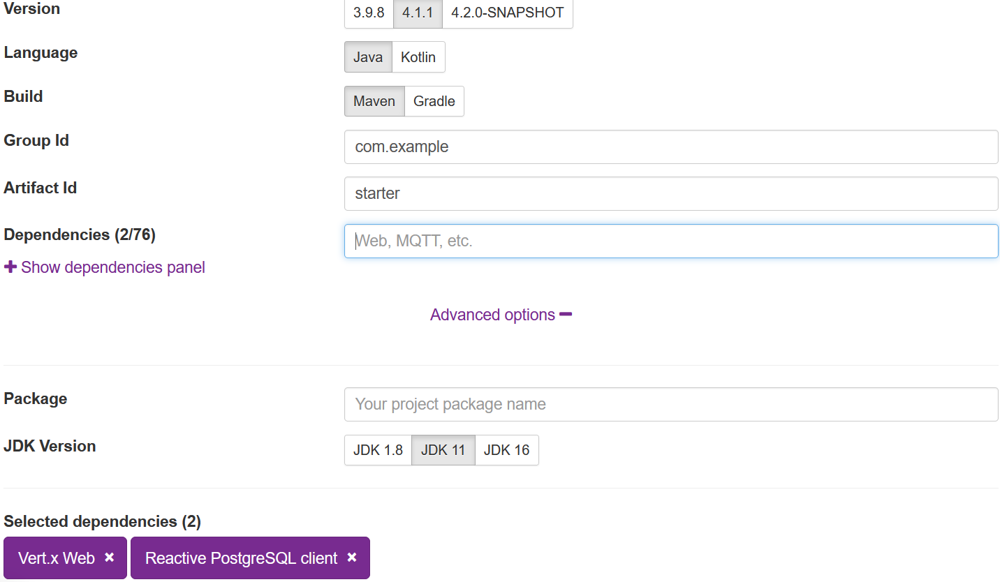

# Building RESTful APIs with Eclipse Vertx

In this post, we will explore the Eclipse Vertx  and build a simple blog RESTful API with Eclipse Vertx and reactive Postgres Client.

Unlike other frameworks in which reactive is an addition to the existing features, Eclipse Vertx is born for reactive applications,  read [the introduction guide](https://vertx.io/introduction-to-vertx-and-reactive/) to get know the reactive support in Vertx .

 Similar to the Spring Boot starter page,  Eclipse Vertx also provides a scaffold page to generate the project skeleton for you.

Open your browser, go to [Vertx Starter](https://start.vertx.io/).  In the **Dependencies** field, select *Vertx Web*, *Reactive  PostgreSQL Client*, and optionally expand the **Advance options** and select the latest Java version(at the moment it is **16**). 




Leave others options as they are, it will use the default values, then hit  **Generate Project** button to generate the project into an archive for downloading.

Download the archive, and extract the files into local disc, and import into your IDEs, eg. Intellij IDEA.

Open the *pom.xml*,  as you see. It uses the `maven-shade-plugin` to package the built results into a fat jar, and  the *Main-Class* is the Vertx built-in `io.vertx.core.Launcher`. When running the application via `java -jar target\xxx.jar` , it will use the `Launcher` to deploy the declared `MainVerticle` .  A `Verticle` is a Vertx specific deployment unit to group  the resources, such as Network, HTTP, etc.

Let's move to the `MainVerticle` class.

```java
public class MainVerticle extends AbstractVerticle {
    
}
```

Generally , to code our business logic, you just need to override the `start()` method or `start(Promise<Void> startPromise)`.

In our application, we will start a Http Server to serve the HTTP requests.  Replace `start(Promise<Void> startPromise)` method with the following codes.

```java
// Create the HTTP server
vertx.createHttpServer()
    // Handle every request using the router
    .requestHandler(router)
    // Start listening
    .listen(8888)
    // Print the port
    .onSuccess(server -> {
        startPromise.complete();
        System.out.println("HTTP server started on port " + server.actualPort());
    })
    .onFailure(event -> {
        startPromise.fail(event);
        System.out.println("Failed to start HTTP server:" + event.getMessage());
    });
```

The `Router` is a specific `Handler<HttpServerRequest>`  which simplifies the handling Http requests and allow chain multiple handlers.

We defines  a  `Router` via `reoutes` to assemble the handling  of all routes.

```java
//create routes
private Router routes(PostsHandler handlers) {

    // Create a Router
    Router router = Router.router(vertx);
    // register BodyHandler globally.
    //router.route().handler(BodyHandler.create());
    router.get("/posts").produces("application/json").handler(handlers::all);
   	router.post("/posts").consumes("application/json").handler(BodyHandler.create()).handler(handlers::save);
    router.get("/posts/:id").produces("application/json").handler(handlers::get).failureHandler(frc -> frc.response().setStatusCode(404).end());
    router.put("/posts/:id").consumes("application/json").handler(BodyHandler.create()).handler(handlers::update);
    router.delete("/posts/:id").handler(handlers::delete);

    router.get("/hello").handler(rc -> rc.response().end("Hello from my route"));

    return router;
}
```

For `post` and `put` Http Methods, the `BodyHandler` is required to consume the  HTTP request body.

 We  extract all handing details into the `PostHandler` class.

```java
class PostsHandler {
    private static final Logger LOGGER = Logger.getLogger(PostsHandler.class.getSimpleName());

    PostRepository posts;

    private PostsHandler(PostRepository _posts) {
        this.posts = _posts;
    }

    //factory method
    public static PostsHandler create(PostRepository posts) {
        return new PostsHandler(posts);
    }

    public void all(RoutingContext rc) {
//        var params = rc.queryParams();
//        var q = params.get("q");
//        var limit = params.get("limit") == null ? 10 : Integer.parseInt(params.get("q"));
//        var offset = params.get("offset") == null ? 0 : Integer.parseInt(params.get("offset"));
//        LOGGER.log(Level.INFO, " find by keyword: q={0}, limit={1}, offset={2}", new Object[]{q, limit, offset});
        this.posts.findAll()
            .onSuccess(
                data -> rc.response().end(Json.encode(data))
            );
    }

    public void get(RoutingContext rc) {
        var params = rc.pathParams();
        var id = params.get("id");
        this.posts.findById(UUID.fromString(id))
            .onSuccess(
                post -> rc.response().end(Json.encode(post))
            )
            .onFailure(
                throwable -> rc.fail(404, throwable)
            );

    }


    public void save(RoutingContext rc) {
        //rc.getBodyAsJson().mapTo(PostForm.class)
        var body = rc.getBodyAsJson();
        LOGGER.log(Level.INFO, "request body: {0}", body);
        var form = body.mapTo(PostForm.class);
        this.posts.save(Post.of(form.getTitle(), form.getContent()))
            .onSuccess(
                savedId -> rc.response()
                    .putHeader("Location", "/posts/" + savedId)
                    .setStatusCode(201)
                    .end()

            );
    }

    public void update(RoutingContext rc) {
        var params = rc.pathParams();
        var id = params.get("id");
        var body = rc.getBodyAsJson();
        LOGGER.log(Level.INFO, "\npath param id: {0}\nrequest body: {1}", new Object[]{id, body});
        var form = body.mapTo(PostForm.class);
        this.posts.findById(UUID.fromString(id))
            .compose(
                post -> {
                    post.setTitle(form.getTitle());
                    post.setContent(form.getContent());

                    return this.posts.update(post);
                }
            )
            .onSuccess(
                data -> rc.response().setStatusCode(204).end()
            )
            .onFailure(
                throwable -> rc.fail(404, throwable)
            );

    }

    public void delete(RoutingContext rc) {
        var params = rc.pathParams();
        var id = params.get("id");

        var uuid = UUID.fromString(id);
        this.posts.findById(uuid)
            .compose(
                post -> this.posts.deleteById(uuid)
            )
            .onSuccess(
                data -> rc.response().setStatusCode(204).end()
            )
            .onFailure(
                throwable -> rc.fail(404, throwable)
            );

    }

}
```

From the `RoutingContext`, it is easy to read the request params etc.  `PostRepository` is responsible for interacting with your backend database Postgres,  when the database operation is done,  then send result to the HTTP response through `RoutingContext.response()`.

Let's have a look at the `PostRepository` class.

```java
public class PostRepository {
    private static final Logger LOGGER = Logger.getLogger(PostRepository.class.getName());

    private static Function<Row, Post> MAPPER = (row) ->
        Post.of(
            row.getUUID("id"),
            row.getString("title"),
            row.getString("content"),
            row.getLocalDateTime("created_at")
        );


    private final PgPool client;

    private PostRepository(PgPool _client) {
        this.client = _client;
    }

    //factory method
    public static PostRepository create(PgPool client) {
        return new PostRepository(client);
    }

    public Future<List<Post>> findAll() {
        return client.query("SELECT * FROM posts ORDER BY id ASC")
            .execute()
            .map(rs -> StreamSupport.stream(rs.spliterator(), false)
                .map(MAPPER)
                .collect(Collectors.toList())
            );
    }


    public Future<Post> findById(UUID id) {
        Objects.requireNonNull(id, "id can not be null");
        return client.preparedQuery("SELECT * FROM posts WHERE id=$1").execute(Tuple.of(id))
            .map(RowSet::iterator)
            .map(iterator -> iterator.hasNext() ? MAPPER.apply(iterator.next()) : null)
            .map(Optional::ofNullable)
            .map(p -> p.orElseThrow(() -> new PostNotFoundException(id)));
    }

    public Future<UUID> save(Post data) {
        return client.preparedQuery("INSERT INTO posts(title, content) VALUES ($1, $2) RETURNING (id)").execute(Tuple.of(data.getTitle(), data.getContent()))
            .map(rs -> rs.iterator().next().getUUID("id"));
    }

    public Future<Integer> saveAll(List<Post> data) {
        var tuples = data.stream()
            .map(
                d -> Tuple.of(d.getTitle(), d.getContent())
            )
            .collect(Collectors.toList());

        return client.preparedQuery("INSERT INTO posts (title, content) VALUES ($1, $2)")
            .executeBatch(tuples)
            .map(SqlResult::rowCount);
    }

    public Future<Integer> update(Post data) {
        return client.preparedQuery("UPDATE posts SET title=$1, content=$2 WHERE id=$3")
            .execute(Tuple.of(data.getTitle(), data.getContent(), data.getId()))
            .map(SqlResult::rowCount);
    }

    public Future<Integer> deleteAll() {
        return client.query("DELETE FROM posts").execute()
            .map(SqlResult::rowCount);
    }

    public Future<Integer> deleteById(UUID id) {
        Objects.requireNonNull(id, "id can not be null");
        return client.preparedQuery("DELETE FROM posts WHERE id=$1").execute(Tuple.of(id))
            .map(SqlResult::rowCount);
    }

}

```


The `pgPool` is a Postgres client to interact with the Postgres database, the API is similar to the traditional Jdbc, but based on the Vertx's `Future`. Similar to Java 8 `CompletionStage` or Reactor  `Mono` /`Flux`, Vertx  Future provides limited APIs for transforming  and observing the completed result.

> More details about the  Reactive PostgreSQL Client, read [PostgreSQL Client docs](https://vertx.io/docs/vertx-pg-client/java/).

> Almost all async methods in Vertx , it provides a variant of accepting a `Promise` callback as parameter instead of return a `Future` instance.  But personally I think the `Promise` is evil if the progress is passed into a sequence of  transitions, thus the `Promise`  will nest another Promise, and so on.

Create a method in the `MainVerticle` to produce a `PgPool` instance.

```java
private PgPool pgPool() {
    PgConnectOptions connectOptions = new PgConnectOptions()
        .setPort(5432)
        .setHost("localhost")
        .setDatabase("blogdb")
        .setUser("user")
        .setPassword("password");

    // Pool Options
    PoolOptions poolOptions = new PoolOptions().setMaxSize(5);

    // Create the pool from the data object
    PgPool pool = PgPool.pool(vertx, connectOptions, poolOptions);

    return pool;
}
```

Create a class to initialize the sample data.

```java
public class DataInitializer {

    private final static Logger LOGGER = Logger.getLogger(DataInitializer.class.getName());

    private PgPool client;

    public DataInitializer(PgPool client) {
        this.client = client;
    }

    public static DataInitializer create(PgPool client) {
        return new DataInitializer(client);
    }

    public void run() {
        LOGGER.info("Data initialization is starting...");

        Tuple first = Tuple.of("Hello Quarkus", "My first post of Quarkus");
        Tuple second = Tuple.of("Hello Again, Quarkus", "My second post of Quarkus");

        client
            .withTransaction(
                conn -> conn.query("DELETE FROM posts").execute()
                    .flatMap(r -> conn.preparedQuery("INSERT INTO posts (title, content) VALUES ($1, $2)")
                        .executeBatch(List.of(first, second))
                    )
                    .flatMap(r -> conn.query("SELECT * FROM posts").execute())
            )
            .onSuccess(data -> StreamSupport.stream(data.spliterator(), true)
                .forEach(row -> LOGGER.log(Level.INFO, "saved data:{0}", new Object[]{row.toJson()}))
            )
            .onComplete(
                r -> {
                    //client.close(); will block the application.
                    LOGGER.info("Data initialization is done...");
                }
            )
            .onFailure(
                throwable -> LOGGER.warning("Data initialization is failed:" + throwable.getMessage())
            );
    }
}
```


Let's assemble all the resources in the `MainVerticle`'s start method.

```java
@Override
public void start(Promise<Void> startPromise) throws Exception {
    LOGGER.log(Level.INFO, "Starting HTTP server...");
    //setupLogging();

    //Create a PgPool instance
    var pgPool = pgPool();

    //Creating PostRepository
    var postRepository = PostRepository.create(pgPool);

    //Creating PostHandler
    var postHandlers = PostsHandler.create(postRepository);

    // Initializing the sample data
    var initializer = DataInitializer.create(pgPool);
    initializer.run();

    // Configure routes
    var router = routes(postHandlers);

    // Create the HTTP server
    vertx.createHttpServer()
        ...
}

```

By default Vertx Web use Jackson to serialize and deserialize the request payload. Unfortunately it does not register Java DateTime module by default.

Add the following dependencies in the *pom.xml* file.

```xml
<dependency>
    <groupId>com.fasterxml.jackson.core</groupId>
    <artifactId>jackson-databind</artifactId>
    <version>${jackson.version}</version>
</dependency>
<dependency>
    <groupId>com.fasterxml.jackson.datatype</groupId>
    <artifactId>jackson-datatype-jsr310</artifactId>
    <version>${jackson.version}</version>
</dependency>
```

Add `<jackson.version>2.11.3</jackson.version>` to the `properties ` section.

Then add a static block to configure DateTime serialization and deserialization in the `MainVerticle` class.

```java
static {
    LOGGER.info("Customizing the built-in jackson ObjectMapper...");
    var objectMapper = DatabindCodec.mapper();
    objectMapper.disable(SerializationFeature.WRITE_DATES_AS_TIMESTAMPS);
    objectMapper.disable(SerializationFeature.WRITE_DATE_TIMESTAMPS_AS_NANOSECONDS);
    objectMapper.disable(DeserializationFeature.READ_DATE_TIMESTAMPS_AS_NANOSECONDS);

    JavaTimeModule module = new JavaTimeModule();
    objectMapper.registerModule(module);
}
```

Let's start the application.  

Get [the source codes](https://github.com/hantsy/vertx-sandbox), simply run the following command to start a Postgres instance in Docker.

```bash
docker compose postgres
```

It will initialize the database tables through [the initial scripts](https://github.com/hantsy/vertx-sandbox/tree/master/pg-initdb.d)  when the database is starting.

Now switch to the project folder, run the following command to start the application.

```bash
mvn clean compile exec:java
```

Or build the project firstly, and run the final jar.

```bash
mvn clean package
java -jar target/demo.jar
```

After the application is started, open a terminal, and use `curl` to test the `/posts` endpoints.

```bash
curl http://localhost:8888/posts -H "Accept: application/json"
[{"id":"1f99032b-3bb0-4795-ba9f-b0437b59cfbe","title":"Hello Quarkus","content":"My first post of Quarkus","createdAt":"2021-07-02T09:35:21.341037"},{"id":"adda9ca6-2c4c-4223-9cb6-b8407c15ba03","title":"Hello Again, Quarkus","content":"My second post of Quarkus","createdAt":"2021-07-02T09:35:21.341037"}]
```

Get [the complete source codes](https://github.com/hantsy/vertx-sandbox/tree/master/post-service) from my Github.
